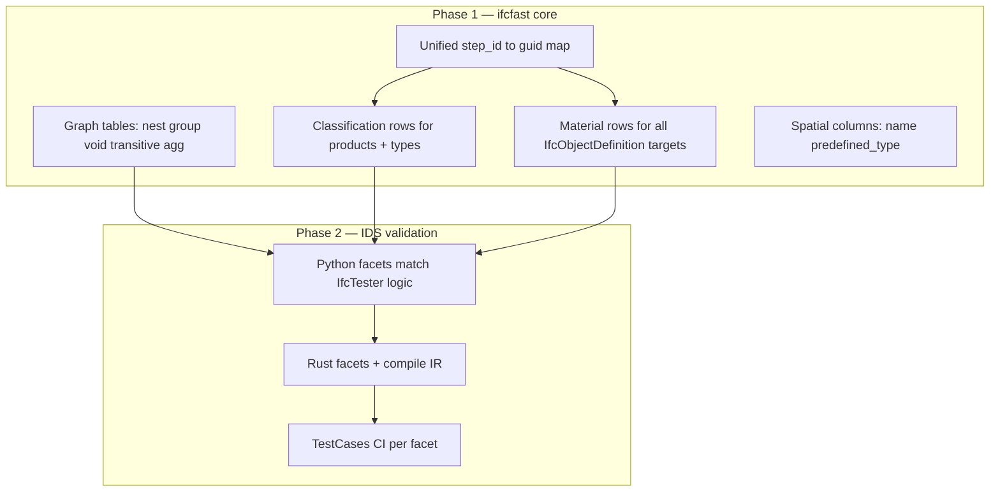

# IDS 1.0 compliance roadmap — ifcfast core first, then IDS

Goal: pass [buildingSMART IDS TestCases](https://github.com/buildingSMART/IDS/tree/development/Documentation/ImplementersDocumentation/TestCases) with **`engine=ifcfast`** / **`engine=rust`** at parity with **IfcTester**, without fallback.

Measure progress: `scripts/run_buildingsmart_ids_conformance.py --facet <facet>`.

---

## Current state (honest)

| Layer | PartOf | Classification | Material |
|-------|--------|----------------|----------|
| **Rust extractors** | Partial graph | `ClassificationTable` exists | `MaterialTable` exists |
| **Python `Model`** | `aggregates`, `contained_in`, `contained_in_space` | `classifications` DF | `materials` DF |
| **Python IDS facets** | `partof.py` — 2 relations | `classification.py` exists | `material.py` exists |
| **Rust `ids` facets** | 2 relations only | always fail | always fail |
| **`support.py` fallback** | nest / group / void | allowed on fast path | allowed on fast path |
| **TestCases (sample)** | not wired in CI | not wired | not wired |

Python Classification/Material are **not** “missing” — they are **under-fed** (extractor GUID scope) and **under-specified** (semantics vs IfcTester). PartOf is **missing graph semantics** (transitive aggregate, extra relations, parent `PredefinedType`).

---

## Root cause: two different problems



**Rule:** Do not add more IDS facet logic until the **columnar data** IfcTester reads via IfcOpenShell is represented in `IndexedFile` / `Model`.

---

## Phase 1 — ifcfast core (indexer + extractors + Model)

### 1.1 Unified `object_step_to_guid` map (P0)

**Problem:** `classifications`, `materials`, and `psets` extractors only attach rows when `obj_step_id` is in **`product_step_to_guid`**. IfcTester’s `IfcRelAssociates*` targets any `IfcObjectDefinition` (products, types, spatial, some property definitions).

**IfcTester reference:** `Classification.filter` / `Material.filter` → `IfcObjectDefinition`; rels resolve on instance step ids.

**Work:**

| Area | Change |
|------|--------|
| `crates/core/src/indexer.rs` | Document/export unified resolver: products + storeys + spaces + buildings + sites + projects + `type_object_step_id` |
| `lib.rs` `extract_*` | Replace `build_guid_index` / `product_step_to_guid` with **`build_object_step_to_guid(indexed)`** for psets, classifications, materials |
| `python/ifcfast/model.py` | Ensure lazy DFs use same scope; optional `objects_step_to_guid` helper |

**Acceptance:** Classifications on an `IfcWallType` appear on all products via `defines_by_type` (see 1.4).

---

### 1.2 PartOf graph tables (P0)

**Problem:** IDS PartOf is not one edge type. IfcTester implements:

| `relation` attribute | IfcOpenShell API | ifcfast today |
|--------------------|------------------|---------------|
| *(empty)* | Walk `get_parent()` chain | ❌ not implemented |
| `IFCRELAGGREGATES` | `get_aggregate()` + **walk up** ancestors | ✅ immediate parent only |
| `IFCRELCONTAINEDINSPATIALSTRUCTURE` | `get_container()` | ✅ storey + space tables |
| `IFCRELASSIGNSTOGROUP` | `HasAssignments` → `IfcRelAssignsToGroup` | ❌ |
| `IFCRELNESTS` | `get_nest()` + ancestor walk | ❌ |
| `IFCRELVOIDSELEMENT IFCRELFILLSELEMENT` | void / fill | ❌ (`voids_*` indexed, unused) |

**PartOf also has nested `<entity>`** (container name + `predefinedType`). ifcfast checks `guid_entity` but **does not index `PredefinedType` on spatial parents**.

**Work:**

| Item | Rust indexer | Model columns |
|------|--------------|---------------|
| `nests_child` / `nests_parent` | Parse `IfcRelNests` | `nests` DF |
| `group_child` / `group_guid` | Parse `IfcRelAssignsToGroup` | `groups` DF |
| Use `voids_opening` / `voids_host` | already parsed | wire in IDS phase |
| **Transitive aggregate** | Optional: closure table `agg_transitive(child, ancestor, depth)` or compute in Python from `aggregates` | |
| **Indirect containment** | TestCase: beam → storey → building via aggregates; need aggregate walk to `IFCBUILDING`, not only `contained_in` | |
| Spatial `predefined_type` | Add `storey_predefined_type`, `space_predefined_type`, etc. if present in STEP | |

**Acceptance:** Green on `partof/pass-the_containment_can_be_indirect_*`, `pass-any_nested_part_passes_a_nest_relationship`, `pass-a_grouped_element_passes_a_group_relationship`, aggregate ancestor cases.

---

### 1.3 Classification extractor depth (P1)

**Problem:** Extractor emits flat rows; IfcTester does more:

1. `get_references(inst)` + **`get_inherited_references`**
2. Match **`value`** on `Identification` / `ItemReference` (IFC2X3)
3. Match **`system`** on `IfcClassification.Name` (enumeration / pattern / restriction)
4. **Type classification → occurrences:** product inherits type’s classification unless overridden per system (TestCase `pass-occurrences_override_the_type_classification_*`)

**Work:**

| Item | Where |
|------|--------|
| Inherited refs | Expand at extract time (denormalize inherited rows) or secondary index `(guid, system, identification)` with parent ref chain |
| Type → product | Join `defines_by_type` + `type_objects`; for each product, copy type classification rows if no product-local row for that `system_name` |
| `facet.system` restrictions | IDS phase: apply `value_matches_restriction` to `system_name` column (not only `==`) |
| Lightweight vs full | TestCase “subreferences” — document as partial or implement prefix match on `identification` |

**Acceptance:** `classification/` TestCases green vs IfcTester on same IFC.

---

### 1.4 Material extractor depth (P1)

**Problem:** `MaterialTable` is rich (layers, constituents, profiles) but IDS facet only checks `material_name` with simple filter. IfcTester:

- Any assigned material / layer / constituent can satisfy `value`
- Type coercion on `value`
- Optional / prohibited cardinality

**Work:**

| Item | Where |
|------|--------|
| Unified guid map | 1.1 |
| Value on layer sets | Match if **any** layer’s `material_name` passes restriction |
| Constituent sets | Same for `role=constituent` |
| Category / value | Optional: expose `category` if IDS packs need it |

**Acceptance:** `material/` TestCases green vs IfcTester.

---

### 1.5 Spatial + attribute columns (P2)

**Problem:** PartOf/Attribute on `IFCSPACE` / `IFCBUILDING` need `Name`, `PredefinedType` like IfcTester.

**Work:** Extend indexer for spatial entities (name/tag/predefined_type where encoded in STEP); expose on `objects` / `spatial` DF (Python already merges spatial into `objects`).

---

### 1.6 Property extractor (P2 — only if IDS packs require)

Nobel/H29 are property-heavy; PartOf/Classification/Material packs may still need:

- `IfcPropertyEnumeratedValue`, `IfcPropertyListValue`, bounded values (IfcTester resolves in `Property.__call__`)
- Unit-normalized values for measures (IfcTester `unit.convert`)

Track via property TestCases + H29 diffs — **do not block** PartOf/Classification/Material on full property parity.

---

## Phase 2 — IDS validation (Python then Rust)

### 2.1 Python facets (align with IfcTester)

| Module | Fixes |
|--------|--------|
| `facets/partof.py` | Transitive `aggregates`; `nests` / `groups` / `voids`; empty `relation` parent walk; `predefinedType` on container; prohibited/optional IDS semantics (same as entity/property) |
| `facets/classification.py` | System restriction; value on identification; optional cardinality; type inheritance from 1.3 |
| `facets/material.py` | Any-row match across roles; optional/prohibited |
| `support.py` | Remove `partof:relation:*` for relations once implemented; keep escape hatch for unimplemented combos only |
| `engine.py` `_rust_fallback_reasons` | Mirror supported set |

### 2.2 Rust `crates/core/src/ids/`

| New module | Purpose |
|------------|---------|
| `classification.rs` | Facet evaluator on `ClassificationTable` keyed by object index |
| `material.rs` | Facet evaluator on `MaterialTable` |
| Extend `facets.rs` `partof` | Transitive + nest/group/void |
| `context.rs` | Load classification/material columns into context (or join at validate) |
| `compile.py` | Export `classification_system`, partof nested entity, material value |

Call `extract_classifications` / `extract_materials` once in `validate_ids_native` (same as psets).

### 2.3 Conformance CI

```powershell
$env:IDS_TESTCASES_ROOT = "C:\code\buildingSMART-IDS\Documentation\ImplementersDocumentation\TestCases"

python scripts\run_buildingsmart_ids_conformance.py --facet partof --engine ifcfast
python scripts\run_buildingsmart_ids_conformance.py --facet classification --engine ifcfast
python scripts\run_buildingsmart_ids_conformance.py --facet material --engine ifcfast
```

Add pytest parametrized modules mirroring `test_buildingsmart_conformance.py`.

Update [IDS_SUPPORT_MATRIX.md](IDS_SUPPORT_MATRIX.md) as each row turns green.

---

## Suggested implementation order

| Sprint | Focus | Unblocks |
|--------|--------|----------|
| **S1** | 1.1 unified guid map + type→product classification join | Classification TestCases |
| **S2** | 1.2 aggregates transitive + spatial predefined_type | H29 PartOf-adjacent + indirect containment |
| **S3** | 1.2 nest + group + void tables | Remaining PartOf TestCases |
| **S4** | 2.1 Python facet parity + PartOf/Classification/Material CI | `engine=ifcfast` without fallback on those facets |
| **S5** | 2.2 Rust extract + validate path for class/mat | `engine=rust` |
| **S6** | 1.6 property gaps only if TestCases/H29 require | Full property IDS |

---

## What we are **not** doing in this roadmap

- Replacing ifcfast indexer with IFClite / IfcOpenShell for batch validate
- Full `IfcObjectDefinition` universe (every IFC entity type) — stay with **indexed objects** (products + spatial + types for associations)
- IFC subclass inheritance for Entity facet (separate TestCase theme)
- IDS XML authoring / Audit-tool (already separate)

---

## Quick reference: IfcTester vs ifcfast data

| IfcTester reads | ifcfast must expose |
|-----------------|---------------------|
| `ifcopenshell.util.classification.get_references` | `classifications` rows per guid |
| `get_inherited_references` | Denormalized or inherited rows |
| Type classification on instances | `defines_by_type` + type classification rows |
| `ifcopenshell.util.element.get_aggregate` chain | Transitive `aggregates` |
| `get_container` | `contained_in` + `contained_in_space` |
| `get_nest` | `nests` table |
| `IfcRelAssignsToGroup` | `groups` table |
| `get_voided_element` / `get_filled_void` | `voids` table |
| Material layers / list | `materials` with `role` column |

---

## Related docs

- [IDS_SUPPORT_MATRIX.md](IDS_SUPPORT_MATRIX.md) — current per-engine status
- [IDS_VALIDATION.md](IDS_VALIDATION.md) — user-facing engines and CLI
